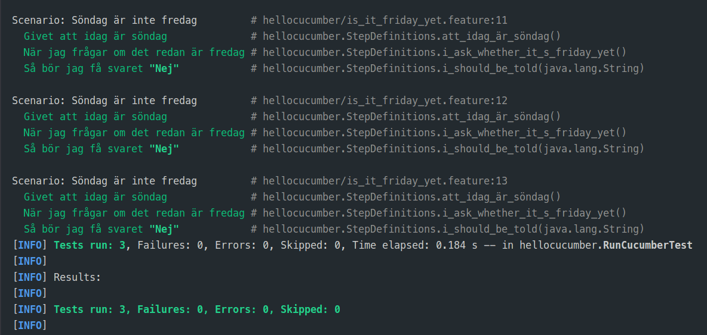

= R5.A.08 -- Dépôt pour les TPs
:icons: font
:MoSCoW: https://fr.wikipedia.org/wiki/M%C3%A9thode_MoSCoW[MoSCoW]

Ce dépôt concerne les rendus de mailto:A_changer@etu.univ-tlse2.fr[Jonh Doe].

== TP1

Feature

[source,gherkin]
---
# language: sv
Egenskap: Är det redan fredag?
  Alla vill veta när det är fredag

  Scenario: Söndag är inte fredag
    Givet att idag är söndag
    När jag frågar om det redan är fredag
    Så bör jag få svaret "Nej"
    Exempel:
      | day            | answer |
      | fredag         | Ja     |
      | söndag         | Nej    |
      | anything else! | Nej    |
---

.Exemple de code
[source,java]
---
Feature: Cocktail Ordering

  As Romeo, I want to offer a drink to Juliette so that we can discuss together (and maybe more).

    Scenario Outline: Creating an empty order
      Given "<owner>" who wants to buy a drink
      When an order is declared for "<target>"
      Then there is <nbCocktails> cocktails in the order

      Examples:
        | owner | target   | nbCocktails |
        | Romeo | Juliette |           0 |
        | Tom   | Jerry    |           0 |
---
image::res/tp2.png[width=80%]

.Exemple d'image insérée en asciidoc
image::artifacts-r303.svg[width=80%]

== TP2...
