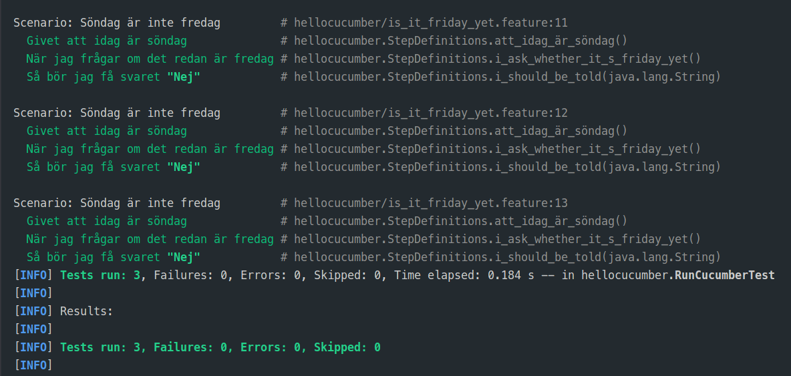
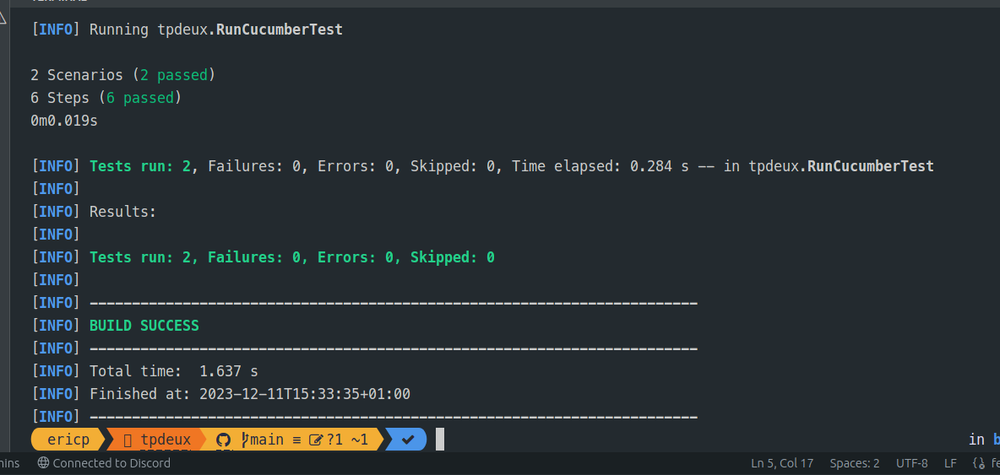
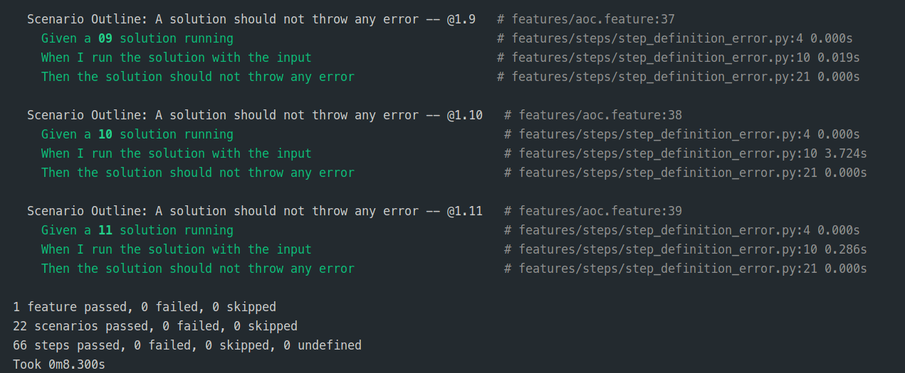
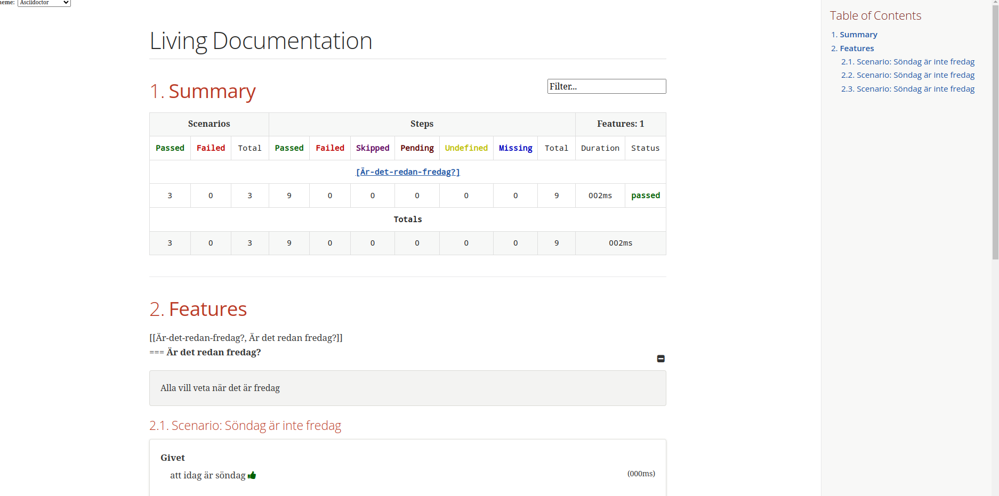
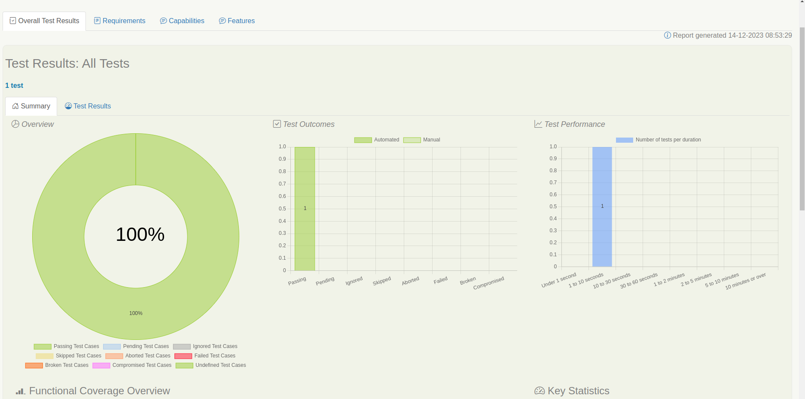

# R5.A.08 -- Dépôt pour les TPs

Ce dépôt concerne les rendus de [Eric PHILIPPE](mailto:eric.philippe@etu.univ-tlse2.fr).

## Sommaire

- [R5.A.08 -- Dépôt pour les TPs](#r5a08----dépôt-pour-les-tps)
  - [Sommaire](#sommaire)
  - [TP1](#tp1)
    - [Feature 1](#feature-1)
    - [Result 1](#result-1)
  - [TP2](#tp2)
    - [Feature 2](#feature-2)
    - [Result 2](#result-2)
  - [TP3](#tp3)
    - [Result 3](#result-3)
  - [TP4](#tp4)
    - [Result 4](#result-4)

## TP1

> Le TP1 a été produit en Java

### Feature 1

```gherkin
# language: sv
Egenskap: Är det redan fredag?
  Alla vill veta när det är fredag

  Scenario: Söndag är inte fredag
    Givet att idag är söndag
    När jag frågar om det redan är fredag
    Så bör jag få svaret "Nej"
    Exempel:
      | day            | answer |
      | fredag         | Ja     |
      | söndag         | Nej    |
      | anything else! | Nej    |
```

### Result 1



## TP2

> Le TP2 a été produit en Java

### Feature 2

```gherkin
Feature: Cocktail Ordering

  As Romeo, I want to offer a drink to Juliette so that we can discuss together (and maybe more).

    Scenario Outline: Creating an empty order
      Given "<owner>" who wants to buy a drink
      When an order is declared for "<target>"
      Then there is <nbCocktails> cocktails in the order

      Examples:
        | owner | target   | nbCocktails |
        | Romeo | Juliette |           0 |
        | Tom   | Jerry    |           0 |
```

### Result 2



## TP3

> Le TP3 a été produit en Python

```gherkin
Feature: Every solution should run quickly and not throw any error

    Scenario Outline: A solution should not last longer than 1 second
        Given a <day> solution
        When I run the solution
        Then the solution should not last longer than <max_time> second

        Examples:
            | day | max_time |
            | 01  | 1        |
            | 02  | 1        |
            | 03  | 1        |
            | 04  | 1        |
            | 05  | 1        |
            | 06  | 1        |
            | 07  | 1        |
            | 08  | 1        |
            | 09  | 1        |
            | 10  | 5        |
            | 11  | 1        |

    Scenario Outline: A solution should not throw any error
        Given a <day> solution running
        When I run the solution with the input
        Then the solution should not throw any error

        Examples:
            | day |
            | 01  |
            | 02  |
            | 03  |
            | 04  |
            | 05  |
            | 06  |
            | 07  |
            | 08  |
            | 09  |
            | 10  |
            | 11  |
```

### Result 3



## TP4

> Le TP4 a été produit en Java

### Result 4




